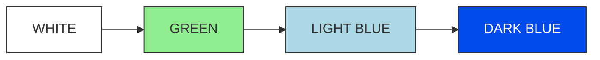
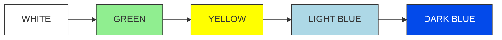
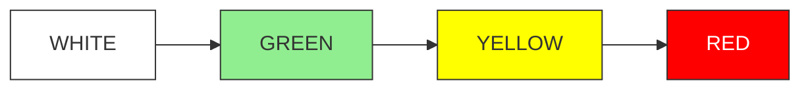
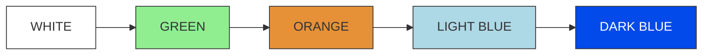
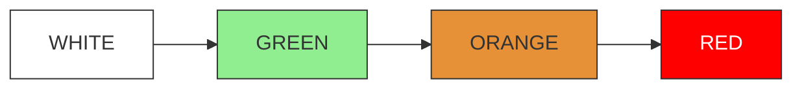
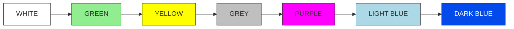
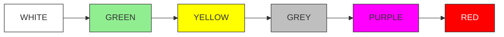

# GABLE: Google Apps Script Longitudinal Participant Management

GABLE is a Google Apps Script framework for managing participants in longitudinal online experiments. It automates scheduling, reminders, session tracking, and incentive workflows so researchers can focus on building their experimental task.

> GABLE manages participants and study flow. You are responsible for building and hosting the task webpage.

## Features

- Tracks multisession progress per participant
- Sends automated reminder and status emails
- Activates sessions based on configurable schedules
- Logs all activity in a Google Sheet
- Reads participant progress from your chosen storage backend
- Supports automated gift card tracking and payouts

## End-to-End Quick Start

GABLE connects three components: a Google Sheet and Apps Script project for participant management, an external storage service for participant state, and your experimental task. Researchers are responsible for configuring all three components.

### 1. Set Up Google Sheets and Apps Script

1. Create a new Google Sheet.
2. Open **Extensions > Apps Script**.
3. Add the required core scripts and your chosen storage adapter from the [`gable`](gable) directory, changing each `.js` extension to `.gs`. Optional administrative scripts do not need to be copied.
4. Before initialization, review:
   - `config.gs`: Study, scheduling, calendar, incentive, and storage settings.
   - `main.gs`: Registration-form questions and instructions.
   - `docinit.gs`: Participant email templates.
   - `Code.gs`: Institutional email-domain and timezone assumptions.

See the [`gable` file guide](gable/README.md) for the complete file list and the [Detailed Configuration Guide](#detailed-configuration-guide) for study settings.

### 2. Choose and Configure Participant-State Storage

Choose a storage service that both GABLE and your experimental task can access. GABLE includes an Azure Blob Storage implementation, but you can replace it with AWS S3, Google Cloud Storage, Firebase, or another service.

Configure the storage credentials in `config.gs`. If you are not using Azure, adapt the storage functions in `gable/azure.js` while preserving their existing function signatures.

See [Choose a Storage Provider](#choose-a-storage-provider). For a working Azure example, see the [task example's Azure setup guide](task-example/AZURE_SETUP.md).

### 3. Initialize and Verify GABLE

Run `initialize()` from the Apps Script editor and approve the requested Google permissions. Initialization:

- Creates the Google Doc containing participant email templates.
- Creates the participant-registration Google Form.
- Creates the study, updates, gift-card, and configuration sheets.
- Creates triggers for registration, storage polling, participant emails, and status updates.
- Sends a setup-confirmation email to the administrator address configured in `config.gs`.

The confirmation email indicates that the initial resources were created; it does not test the participant workflow. Run `initialize()` only for initial setup, because rerunning it can create duplicate resources or triggers.

### 4. Integrate the Experimental Task

Configure your task to update each participant's JSON state file as sessions and trials progress. This integration is the researcher's responsibility; GABLE reads this file to determine participant progress and schedule notifications.

See [Integration with Your Task Webpage](#integration-with-your-task-webpage) for the required fields and file structure. A concrete jsPsych and Node example is available in [`task-example`](task-example).

### 5. Test the Complete Workflow

Before recruiting participants:

1. Submit the generated registration form using your own email address.
2. Confirm that the participant appears in the Google Sheet.
3. Confirm that the initial participant-state file is created in storage.
4. Complete a test session in the task.
5. Confirm that the task updates the state file and GABLE detects the change.

See [Testing](#testing) for more testing guidance.

## Detailed Configuration Guide

This section describes the study settings in [`gable/config.js`](gable/config.js). When creating the Apps Script project, copy this file as `config.gs`.

### Global Study Parameters

```js
const NUM_SESSIONS = 10;
const NUM_GROUPS = 7;
const DAYS_INTERVAL = 2;
const DAYS_INTERVAL_TEXT = "1-3 days";

```

- `NUM_SESSIONS`: Total number of sessions in the longitudinal study. Used throughout the script for scheduling and study logic.

- `NUM_GROUPS`: Number of experimental groups. Must match the number of entries in `GROUPS_MAPPING`, `groupIndexMapping`, and `indexGroupMapping`.

- `DAYS_INTERVAL`: Default number of days between sessions. Each session’s daysBeforeNext is initialized with this value.

- `DAYS_INTERVAL_TEXT`: Human readable description of the intended return window, used in communication to participants.


### Group Definitions

```js
const GROUPS_MAPPING = {
  "G00": "Baseline - Baseline",
  "G01": "Baseline - Variant 1",
  "G02": "Baseline - Variant 2",
  "G11": "Variant 1 - Variant 1",
  "G12": "Variant 1 - Variant 2",
  "G21": "Variant 2 - Variant 1",
  "G22": "Variant 2 - Variant 2"
};
```

- `GROUPS_MAPPING`: Maps group IDs (e.g., `G00`) to human readable condition labels. Edit labels here if you change experimental conditions.

Index mappings must stay consistent:

```js
const groupIndexMapping = { /* index → groupId */ }
const indexGroupMapping = { /* groupId → index */ }
```

The assertions at the bottom ensure that `NUM_GROUPS` matches all three mappings. If you add or remove a group, update these mappings and `NUM_GROUPS` together.

### `STUDIES` Object

Currently the script assumes exactly one active study:

```js
var STUDIES = {
  GABLE_01: { ... }
};

assert(Object.keys(STUDIES).length === 1, "...only one study...");
```

Do not add additional entries unless you are ready to refactor the code.

Inside `GABLE_01` you must customize:

```javascript
name: "GABLE Experiment",
admin_name: "Admin Name",
website: "https://google.com",
preexperiment: "------TODO-----------",
email: "email@example.com",
folderID: "------TODO-----------",
updateeEmails: ["email1@case.edu", "email2@case.edu"],
adminCalendarId: "------TODO-----------",
```

- `name`: Study name for internal reference.

- `admin_name`: Primary administrator name, used in emails.

- `website`
URL of your experimental task.

- `preexperiment`: URL of a pre experiment survey.

- `email`: Contact email for participants. You may provide multiple addresses separated by commas.

- `folderID`: Google Drive folder ID where logs and exports are stored.

- `updateeEmails`: List of addresses that receive daily status updates.

- `adminCalendarId`: Google Calendar ID where participant sessions are scheduled.

#### Group and Incentive Settings

```javascript
groups: {
  number: NUM_GROUPS,
  numSessions: NUM_SESSIONS,
  giftCardAmountPerSession: 5,
  giftCardAmountAfterCompletion: 100
},
halfSessionNumber: Math.floor(NUM_SESSIONS/2),
```

- `giftCardAmountPerSession`: Payment per completed session.

- `giftCardAmountAfterCompletion`: Completion bonus after finishing all sessions.

- `halfSessionNumber`: Automatically computed midpoint session, used for logic that depends on “first half” vs “second half”.

#### Late Session Grace Period

```javascript
lateSessionGraceDays: {
  shouldGiveGrace: true,
  afterSession: 5,
  graceDaysNumber: 3
},
```

- `shouldGiveGrace`: Enable or disable a grace period.

- `afterSession`: Starting after this session number, the grace logic applies.

- `graceDaysNumber`: Number of extra days given if a participant misses the scheduled time.


#### Study Data Structure
```js
studyData: Array.from({ length: NUM_SESSIONS }, (_, i) => ({
  sessionName: (i + 1).toString(),
  daysBeforeNext: DAYS_INTERVAL
})),

```

- This creates the session schedule with a default interval of `DAYS_INTERVAL` days between all sessions.

- **Customization**: While the default implementation uses uniform intervals, you can modify this array to implement varying schedules. For example, you might want shorter intervals for minor check-in sessions and longer intervals for major assessment sessions, or gradually increasing intervals as the study progresses. To customize intervals, replace the `Array.from()` with a manual array definition where you can set each session's `daysBeforeNext` individually:

Here is an example of explicitly defining individual session intervals:

```js
studyData: [
  { sessionName: "1", daysBeforeNext: 2 },
  { sessionName: "2", daysBeforeNext: 2 },
  { sessionName: "3", daysBeforeNext: 7 },  // longer interval
  { sessionName: "4", daysBeforeNext: 2 },
  // ... continue for all sessions
],
```


#### Invalidation Rules


```js
numberOfDaysToInvalidateIncompleteSession: 1,
numberOfHoursToInvalidateIncompleteSession: 2,
```

Controls how quickly an incomplete session becomes invalid. These are used to define timeouts after a participant starts but does not finish a session.

#### Sign-up Valid Time Ranges

```js
experimentValidTimeRange: [8, 22]
```

If a user selects a time outside the valid range, it is automatically adjusted to the nearest allowable time. All times are interpreted in 24-hour format.


#### Status Storage

```js
collecting: true,
sasToken: "?sv=xxxx",
storageAccountName: "xxxx",
storageContainer: "xxxx",
```

- `collecting`: Set to true to enable data collection from your storage backend.

- `sasToken`, `storageAccountName`, `storageContainer`: Azure storage related fields that establish connection for your storage backend. Fill these in with your own credentials (or adapt to your own storage solution).

### Session Status Color Values

The session-status color constants are also defined at the bottom of `gable/config.js`. See [Session Status Colors](#session-status-colors) for their meanings and lifecycle transitions.

## Choose a Storage Provider

GABLE only requires the ability to read and write JSON. The included storage implementation is in [`gable/azure.js`](gable/azure.js), which communicates with Azure Blob Storage using SAS tokens. When creating the Apps Script project, copy this source file as `azure.gs`.

If you want to use a different storage provider (for example AWS S3, GCP Storage, Firebase), replace the implementation of the storage access functions while keeping their function signatures the same.


Specifically, you should update:

- Single-file read helper

  - `readAzureFile(study, filename)`

  - `constructAzureBlobUrl(...)` and any URL/token handling (for example `cleanToken`)

  - These should call your provider’s “download object” API and return the parsed JSON.

- Initial registration (first write)

  - `registerUserToDatabase(userID, groupID, sessionStartTime, study)`

    - `Replace the Azure PUT request with the equivalent “create object” call in your provider.`

  - `Updating existing participant files`

    - `terminateUser(study, file)`

    - `updateStartDateUser(study, file, newStartTime)`

    - `getSessionCompletionTimeRefetch(study, file, sessionNumber)`

    - `getLastTrialCompletedTimeRefetch(study, file, sessionNumber)`

    - These should fetch the JSON file from your storage, modify it, and upload it back using your provider’s API.

- Listing participant files

  - `blobDictionary(study)`

  - This implements Azure’s “list blobs” operation and parses the XML response. Replace it with your provider’s “list objects” call and return a dictionary mapping filenames to timestamps.

All other functions that operate on JSON objects (getSessionCompletionTime, getLastTrialCompletedTime, getSessionStartTime, etc.) can remain unchanged as long as your task writes the same JSON schema and file naming pattern (for example pID{userId}_gable.json).


## Integration with Your Task Webpage

Your task saves a JSON state file for each participant. It can be stored in Azure, AWS, GCP, Firebase, or any storage reachable through HTTP fetch. The filename format is customizable; in the current implementation it follows:

```
pID{userId}_gable.json
```

### Required JSON Structure

```json
{
  "userId": "fa4ae08",
  "group": "G11",
  "sessionNumber": 1,
  "trialNumber": 5,
  "firstTrialStartTime": "12/10/2025 10:35:00 AM",
  "sessionCompleted": true,
  "trialCompleted": true,
  "accountTerminated": false,
  "lastTrialCompletedTime": "12/10/2025 11:35:00 AM",
  "sessionActivationTime": "12/10/2025 10:30:00 AM",
}
```

### Fields Your Task Must Maintain

| Field | Description | Updated by |
|-------|-------------|------------|
| `sessionNumber` | Current session | Task |
| `trialNumber` | Current trial | Task |
| `sessionCompleted` | Session finished | Task |
| `trialCompleted` | Trial finished | Task |
| `firstTrialStartTime` | First trial time of current session | Task |
| `lastTrialCompletedTime` | Last completed trial time of the user | Task |
| `sessionActivationTime` | When session activated | GABLE |
| `accountTerminated` | Removed or dropped | Admin |

### Initial File Created by GABLE

```json
{
  "sessionNumber": 0,
  "trialNumber": 0,
  "sessionCompleted": true,
  "trialCompleted": true
}
```

## Workflow

1. **Sign up**: GABLE writes the participant to the Sheet and creates the initial JSON file
2. **Session activation**: GABLE opens the next session based on your timing rules
3. **Task participation**: Your webpage updates the JSON as the participant progresses
4. **Monitoring and email**: Scheduled checks read the JSON file and update Sheets and emails
5. **Completion and incentives**: Gift card logic tracks progress and completion payments

## Session Status Colors

Session-status color values are defined in [`gable/config.js`](gable/config.js). Most lifecycle transitions are applied in [`gable/Code.js`](gable/Code.js), with participant-state and administrative updates also handled in [`gable/azure.js`](gable/azure.js) and [`gable/python_api.js`](gable/python_api.js).

GABLE uses color codes to track participant session states. Each color represents a specific stage in the session lifecycle:

- $${\color{black}WHITE}$$: Next session date calculated but session notification email not yet sent to participant.
- $${\color{green}GREEN}$$: Next session email sent to participant, including calendar invite and session begin/end dates.
- $${\color{lightblue}LIGHT \space BLUE}$$: Session completed and data saved to cloud database, but completion emails not yet sent.
- $${\color{blue}DARK \space BLUE}$$: Session completed, data saved to cloud database, and completion emails sent to participants.
- $${\color{yellow}YELLOW}$$: Session not started with 1 day remaining until due date. Reminder emails sent to participants.
- $${\color{orange}ORANGE}$$: Session started but left incomplete for e.g., 24 hours (configurable). Incomplete session email sent to participant.
- $${\color{grey}GREY}$$: Grace period granted (3 days in current implementation, configurable) for sessions after session e.g., 14 (but configurable).
- $${\color{purple}PURPLE}$$: Grace period previously granted with 1 day remaining before grace period expires.
- $${\color{red}RED}$$: Participant invalidated due to session not completed on time. Invalidation email and gift cards sent.

### 1. Successfully Completed Session on Time



### 2. Successfully Completed but Reminder Email Sent



### 3. Session Not Completed After Reminder Email



### 4. Successfully Completed After an Incomplete Session



### 5. Session Not Completed After an Incomplete Session



### 6. Completed During the Grace Period

After the configured session number (for example, session 15), the study is marked complete when the participant finishes after receiving a grace-period reminder.



### 7. Not Completed During the Grace Period

After the configured session number (for example, session 15), the study is not completed if the participant fails to finish after receiving a grace-period reminder.



## Time Based Triggers

Trigger creation is implemented in [`gable/main.js`](gable/main.js), where `initialize()` calls `createTriggers()`.

Initialization creates triggers that:

- Activate sessions
- Send reminders
- Poll the storage JSON files
- Update Sheets
- Create optional summaries

## Logs and Monitoring

Logging is implemented by GABLE's custom `Logger` class in [`gable/Logger.js`](gable/Logger.js), copied into Apps Script as `Logger.gs`.

GABLE produces two kinds of records that let you monitor a running study:

- **Execution logs.** During every run, GABLE emits leveled status messages (`INFO`, `WARNING`, `ERROR`, etc.) through this logger. These appear in the **Executions** panel of the Apps Script editor (open the Apps Script project, then select **Executions** in the left sidebar), where each scheduled or triggered run is listed with its function name, status, timestamp, and log output. No additional setup is required.
- **Activity records.** Participant progress is written to the linked Google Sheet in real time.

## Updates and Status Reporting

Status aggregation and summary emails are implemented in [`gable/Updates.js`](gable/Updates.js), copied into Apps Script as `Updates.gs`.

GABLE tracks operational statistics through its Updates channel. A dedicated
`[studyName]Updates` tab accumulates daily counts of key events, including
sign-ups, session and study completions, gift cards issued, server errors,
missed and invalidated sessions, reminder emails sent, grace periods granted,
and remaining gift-card stock. On a schedule, GABLE compiles these counts into
a status-summary email sent to the addresses listed in `updateeEmails`.

## Administrative API

The administrative endpoint is implemented in [`gable/python_api.js`](gable/python_api.js), copied into Apps Script as `python_api.gs`.

For advanced or batch operations, GABLE can be deployed as an Apps Script web
app that exposes a `doGet` endpoint. In the Apps Script editor, choose
Deploy → New deployment → Web app, and use the resulting `/exec` URL as
`APPS_SCRIPT_URL`. Each request names a `functionName` and its parameters, so a
single authenticated call can run an administrative action such as
`reactivateUser`, `rescheduleUser`, `renameUserId`, `runClean`,
`sendAllStudyEmails`, or `updateConfigTime`.

Requests are authenticated with a Google account that has access to the study,
using standard Google OAuth. A minimal call looks like:

    # `session` is an authenticated Google session for an account with study access
    params = {
        "functionName": "reactivateUser",
        "participantId": "p123",
        "timestamp": "2026-01-15T10:00:00.000Z",
    }
    response = session.get(APPS_SCRIPT_URL, params=params)
    response.raise_for_status()
    print(response.text)

## Testing and Customization

### Testing

#### Basic Testing Workflow

**1. Add a Test Participant**

- Fill out the Google Form to sign up a test participant
- Verify that the participant's record appears as a new row in the Google Sheet

**2. Trigger Email and Session Processing**

Choose one of the following methods:

- **Automatic (recommended for production)**: Wait for the scheduled trigger to run automatically
- **Manual (recommended for testing)**:
  - Open the Google Sheet and navigate to the **Config** tab
  - Update the `TIME` value using ISO 8601 format (e.g., `2025-12-29T14:30:00.000Z`)
  - Open the Apps Script editor and manually run the `sendAllStudyEmails` function in [Code.gs](gable/Code.js)

**3. Complete a Test Session**

- Navigate to your task experiment webpage
- Complete the experimental task as a participant would
- Ensure your task writes the completion status to the JSON storage file

**4. Verify Session Completion**

- Adjust the `TIME` value in the Config tab to simulate time passing (if needed)
- Re-run the `sendAllStudyEmails` function
- Confirm that GABLE recognizes the session completion:
  - The session cell in the Google Sheet changes color (green → light blue → dark blue)
  - A completion confirmation email is sent to the participant

This workflow allows you to test the full participant lifecycle, from signup through session completion, without waiting for actual days to pass between sessions.

### Customization

Edit in `config.js` (or `.gs` if already moved to Apps Script project) and email templates:

- Session spacing
- Group definitions
- Payout amounts
- Allowed windows for completion
- Storage helper functions

<!-- ## Citation

If you use GABLE in published work, please cite the following manuscript:

> Berber, I., Kas, I., Sepuri, T., Macnamara, B. N., Çavuşoğlu, M. C., Wilson-Delfosse, A. L., Krupinski, E. A., Smith, P. J., & Ray, S. (under review). GABLE: Lightweight infrastructure for longitudinal experiments using Google Apps Script. *Behavior Research Methods*. -->

## License

GABLE is available under the [PolyForm Noncommercial License 1.0.0](LICENSE). This source-available license permits the noncommercial uses described in its terms; it is not an OSI-approved open-source license.

Commercial use requires a separate written license. See [Commercial Licensing](COMMERCIAL-LICENSE.md) for inquiry instructions.
